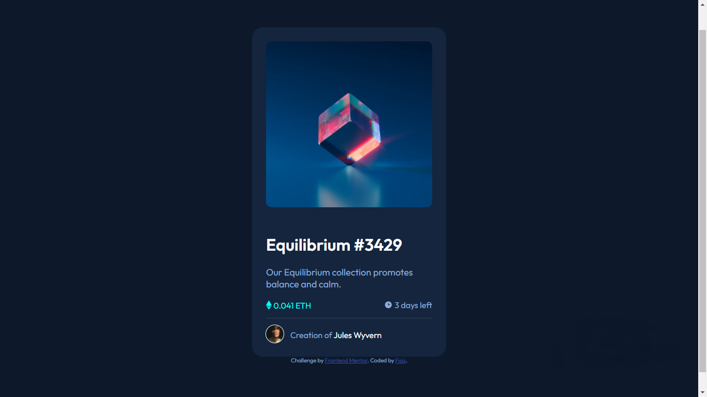

# Frontend Mentor - NFT preview card component solution

This is a solution to the [NFT preview card component challenge on Frontend Mentor](https://www.frontendmentor.io/challenges/nft-preview-card-component-SbdUL_w0U). Frontend Mentor challenges help you improve your coding skills by building realistic projects.

## Table of contents

- [Overview](#overview)
  - [The challenge](#the-challenge)
  - [Screenshot](#screenshot)
  - [Links](#links)
- [My process](#my-process)
  - [Built with](#built-with)
  - [What I learned](#what-i-learned)
  - [Continued development](#continued-development)
  - [Useful resources](#useful-resources)
- [Author](#author)
- [Acknowledgments](#acknowledgments)

**Note: Delete this note and update the table of contents based on what sections you keep.**

## Overview

### The challenge

Users should be able to:

- View the optimal layout depending on their device's screen size
- See hover states for interactive elements

### Screenshot

### Links

- Solution URL: [Add solution URL here](https://your-solution-url.com)
- Live Site URL: [Add live site URL here](https://your-live-site-url.com)

## My process

### Built with

- HTML
- CSS

### What I learned

- CSS attributes:
  - border-radius
  - width: 100%;
    to fill in empty space or to center text using text-align.
  - opacity
  - visibility: hidden;
  - basic practical knowledge about display: flexbox

### Continued development

- will try to improve my skill in web design using CSS.
- planning to learn more about google chrome devtool and how people use it.

### Useful resources

- Atom text editor
- google devtool
- [w3schools.com](https://www.w3schools.com/) - explanations that is easy to understand.
- [Dr. Angela bootcamp from Udemy](https://www.udemy.com/user/4b4368a3-b5c8-4529-aa65-2056ec31f37e/) - she is the first person who teach me how to code, as far as i can remember.
- [Kevin Powell youtube channel](https://www.youtube.com/channel/UCJZv4d5rbIKd4QHMPkcABCw) - generous tutorials and easy to understand.

## Author

- Frontend Mentor - [@fullyarmored](https://www.frontendmentor.io/profile/fullyarmored)

## Acknowledgments

this is the very first challange i did, thanks to [Adrian Burgos](https://www.frontendmentor.io/profile/adrianburgoscolas) i had no clue how to do challanges and post solutions, so i checked out his solution and started learning from there.

This is where you can give a hat tip to anyone who helped you out on this project. Perhaps you worked in a team or got some inspiration from someone else's solution. This is the perfect place to give them some credit.
