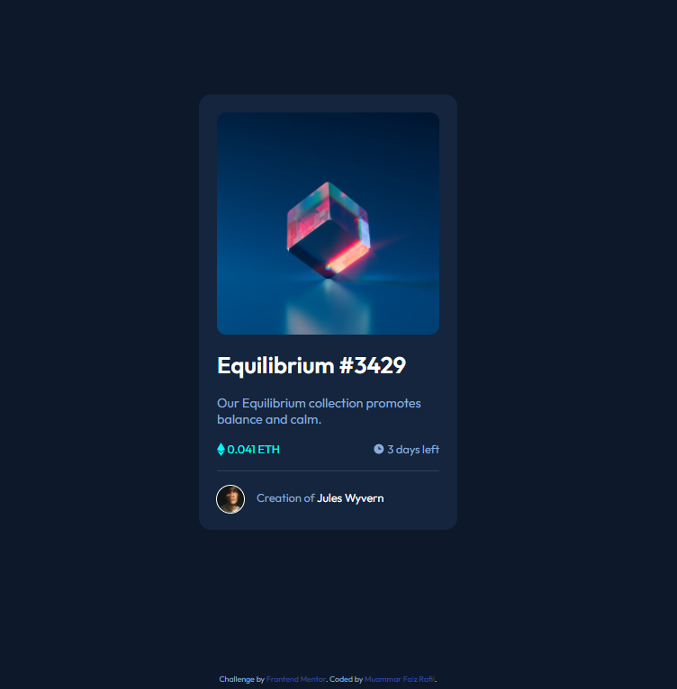

# Frontend Mentor - NFT preview card component solution

This is a solution to the [NFT preview card component challenge on Frontend Mentor](https://www.frontendmentor.io/challenges/nft-preview-card-component-SbdUL_w0U). Frontend Mentor challenges help you improve your coding skills by building realistic projects.

## Table of contents

- [Overview](#overview)
  - [The challenge](#the-challenge)
  - [Screenshot](#screenshot)
  - [Links](#links)
- [My process](#my-process)
  - [Built with](#built-with)
  - [What I learned](#what-i-learned)
  - [Continued development](#continued-development)
  - [Useful resources](#useful-resources)
- [Author](#author)
- [Acknowledgments](#acknowledgments)

**Note: Delete this note and update the table of contents based on what sections you keep.**

## Overview

### The challenge

Users should be able to:

- View the optimal layout depending on their device's screen size
- See hover states for interactive elements

### Screenshot



### Links

- Solution URL: [Solution](https://github.com/fullyarmored/frontendmentor-NFT-preview-card-component)
- Live Site URL: [Live site](https://muammarfaiz.github.io/frontendmentor-NFT-preview-card-component/)

## My process

### Built with

- HTML
- CSS Grid
- Mobile-first workflow

### What I learned

- basic knowledge about display grid
- CSS property opacity for interactive hover state element

the most complex CSS styling I did for this project is this:
```
interactive hover state element for the main image

.mainImage {
  width: 100%;
  border-radius: 13px;
  grid-column-start: 1;
  grid-row-start: 1;
}

.mainImageContainer:hover .mainImage {
  opacity: 0.5;
}

.mainImageContainer:hover .hoverImagebg {
  visibility: visible;
}

.hoverImagebg {
  background-color: hsl(215, 51%, 70%);
  width: 100%;
  border-radius: 14px;
  text-align: center;
  grid-column-start: 1;
  grid-row-start: 1;
  display: grid;
  place-items: center;
  visibility: hidden;
}
```

### Continued development
I am interested to do better in CSS styling

Repetition is the mother of mastery

### Useful resources

- [Kevin Powell youtube channel](https://www.youtube.com/kepowob) - 
 he is an amazing teacher is an understatement.
- [Dr. Angela Yu from Udemy](https://www.udemy.com/user/4b4368a3-b5c8-4529-aa65-2056ec31f37e/) - 
Her courses are fun, effective and easy to understand even for beginners.
- [w3schools website](https://www.w3schools.com/) -
 explanations that is easy to understand for beginners
- [developer.mozilla.org](https://developer.mozilla.org/en-US/) -
 may I say, one of the best documentation for web developers.

## Author

- Frontend Mentor - [@fullyarmored](https://www.frontendmentor.io/profile/fullyarmored) or you can call me faiz.
- github - [fullyarmored](https://github.com/fullyarmored)

## Acknowledgments
this is my second try of the very first challenge I did, thanks to Adrian Burgos i had no clue how to do challanges and post solutions, so i checked out his solution and started learning from there.
